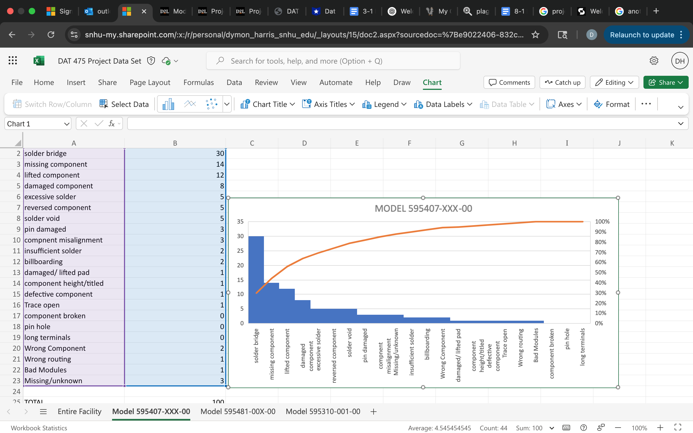
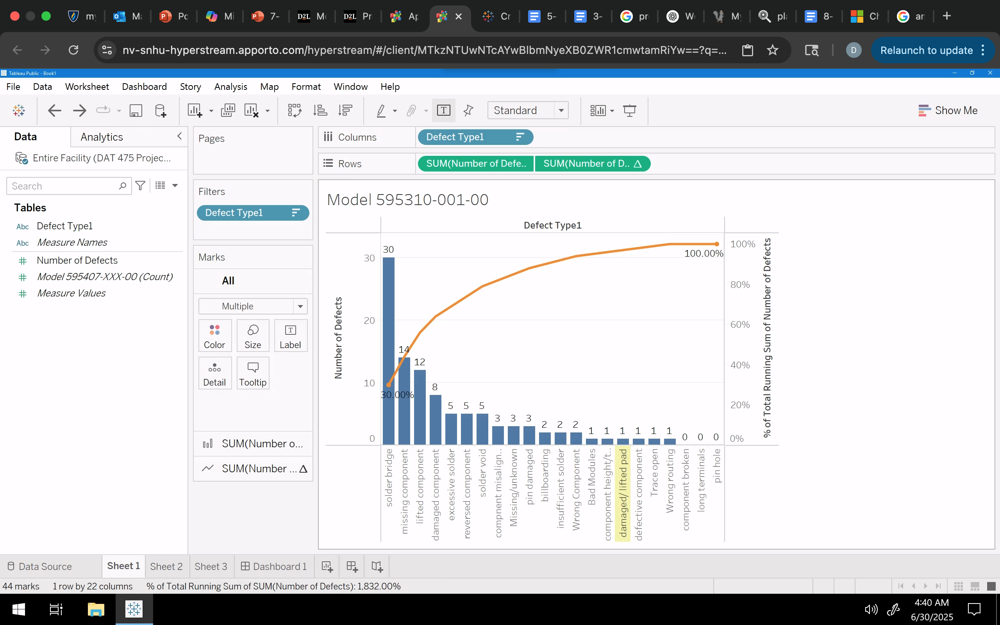

# Dymon's Portfolio 

<html>
<body>

<h1></h1>

</body>
</html>
# Hi, I’m Dymon 👋
 

📊 **Aspiring Data Analyst** with hands-on experience in:
- Predictive modeling & machine learning
- Exploratory data analysis (EDA)
- Process improvement & quality analysis

## 🔍 Featured Projects
- 🏭 **Manufacturing Defect Reduction Analysis**  
  Data-driven quality improvement using defect trend analysis and root cause frameworks

- 📉 **Employee Attrition Prediction**  
  Machine learning models (Logistic Regression & Random Forest) to identify turnover risk

## 🛠 Tools & Skills
- Python (Pandas, Scikit-learn, Matplotlib)
- Data Visualization & EDA
- Statistical Analysis
- Business & Operational Insights
    

📫 *Open to data analyst opportunities*

# 🏭 Manufacturing Defect Reduction Analysis  
### 📊 Quality Improvement in Electronic Board Production

> A data-driven process improvement project focused on reducing welding defects while increasing production capacity in an electronics manufacturing facility.

---

## 📌 Project Overview

A manufacturing plant producing electronic circuit boards experienced a rise in **welding-related defects** during the **Manual Finish (Thru-Hole) process**, while also facing increased product demand.

These defects led to:
- Higher failure rates in final assembly and testing  
- Increased rework and production delays  
- Risk of non-compliance with **IPC-A-610E** quality standards  

### 🎯 Project Goals
- Reduce welding defects by **20%**
- Increase production capacity by **20%** without raising defect rates

---

## 🗂 Dataset Description

The analysis included defect data from:
- The **entire manufacturing facility**
- Multiple **high-volume product models**

Each record included:
- Defect type  
- Affected product model  
- Frequency of occurrence  

This allowed for both **facility-wide** and **model-level** defect analysis.

---

## 🛠 Tools & Skills Demonstrated

- 📈 Defect frequency analysis  
- 🧮 Data aggregation and categorization  
- 🧠 Root cause analysis (Fishbone/Ishikawa method)  
- 🏭 Process improvement strategy development  
- 📊 Data-driven operational decision making  

---

## 🧹 Data Preparation

To ensure consistency and accuracy:

- Standardized defect naming (e.g., *Solder Bridge*, *Excessive Solder*)  
- Grouped defects by type and product model  
- Calculated frequencies to identify high-impact defect categories  

---

## 📊 Exploratory Analysis

### 🔍 Facility-Wide Defect Trends

The most frequent defects across the facility were:

| Rank | Defect Type        | Impact |
|------|--------------------|--------|
| 1️⃣ | **Solder Bridge**     | Highest contributor to failures |
| 2️⃣ | **Excessive Solder**  | Affected solder joint quality |
| 3️⃣ | **Missing Components**| Caused assembly/test failures |

👉 These three defect types became the primary focus for improvement efforts.

---

### 🏷 Model-Specific Defect Patterns

| Product Model        | Most Common Defects |
|----------------------|---------------------|
| 595407-XXX-00        | Solder Bridges, Missing Components, Lifted Components |
| 595481-00X-00        | Solder Bridges, Lifted Components, Wrong Components |
| 595310-001-00        | Excessive Solder, Solder Bridges, Damaged Components |

🔎 **Key Insight:**  
**Solder Bridge defects appeared across nearly all models**, indicating a systemic process issue rather than a product-specific problem.

---

## 🧠 Root Cause Analysis

A Fishbone (Ishikawa) framework was used to categorize likely root causes.

### ⚙️ Methods
- Inconsistent soldering procedures  
- Lack of standardized work instructions  

### 👷 People
- Insufficient operator training  
- Worker fatigue  
- Communication gaps between shifts  

### 🏭 Machines
- Equipment calibration issues  
- Inconsistent soldering temperatures  
- Inspection gaps  

### 🧪 Materials
- Poor solder quality or storage  
- Defective or incorrect components  
- Weak incoming material inspection  

---

## 💡 Key Findings

- **Solder Bridge defects** were the most critical and widespread issue  
- Defect patterns were consistent across models, pointing to **process variability**  
- Manual operations showed signs of **training, inspection, and standardization gaps**

---

## 🚀 Recommendations

### ✅ Process Improvements
- Standardize soldering procedures (SOPs)  
- Implement recurring operator certification and training  
- Add visual job aids at workstations  

### 🔧 Equipment & Inspection
- Establish preventive maintenance schedules  
- Improve in-process inspections  
- Consider Automated Optical Inspection (AOI)

### 📦 Material Controls
- Strengthen incoming component inspections  
- Improve solder material handling and storage  

### 👥 Workforce Optimization
- Rotate operators to reduce fatigue  
- Improve shift communication with structured handoff logs  

---

## 📈 Expected Business Impact

If implemented, these improvements would:

✔ Target the highest-frequency defects  
✔ Support a **20% defect reduction goal**  
✔ Enable increased production without quality loss  
✔ Improve compliance with IPC-A-610E standards  
✔ Reduce rework costs and improve operational efficiency  

---

## 🏁 Conclusion

This project demonstrates how structured data analysis combined with quality engineering principles can drive measurable improvements in manufacturing performance.

It highlights the ability to:
- Translate data into operational insights  
- Identify systemic process issues  
- Recommend actionable, business-focused solutions  

---

📬 *Feel free to explore the project files and analysis for more detail on the methodology and findings.*

A bit of the GitHub spice
-------------------------

In addition to the changes in the previous section, certain references are auto-linked:

* SHA: be6a8cc1c1ecfe9489fb51e4869af15a13fc2cd2
* User@SHA ref: mojombo@be6a8cc1c1ecfe9489fb51e4869af15a13fc2cd2
* User/Project@SHA: mojombo/god@be6a8cc1c1ecfe9489fb51e4869af15a13fc2cd2
* \#Num: #1
* User/#Num: mojombo#1
* User/Project#Num: mojombo/god#1

These are dangerous goodies though, and we need to make sure email addresses don't get mangled:

My email addy is tom@github.com.

Math is hard, let's go shopping
-------------------------------

In first grade I learned that 5 > 3 and 2 < 7. Maybe some arrows. 1 -> 2 -> 3. 9 <- 8 <- 7.

Triangles man! a^2 + b^2 = c^2

We all like making lists
------------------------

The above header should be an H2 tag. Now, for a list of fruits:

* Red Apples
* Purple Grapes
* Green Kiwifruits

Let's get crazy:

1.  This is a list item with two paragraphs. Lorem ipsum dolor
    sit amet, consectetuer adipiscing elit. Aliquam hendrerit
    mi posuere lectus.

    Vestibulum enim wisi, viverra nec, fringilla in, laoreet
    vitae, risus. Donec sit amet nisl. Aliquam semper ipsum
    sit amet velit.

2.  Suspendisse id sem consectetuer libero luctus adipiscing.

What about some code **in** a list? That's insane, right?

1. In Ruby you can map like this:

        ['a', 'b'].map { |x| x.uppercase }

2. In Rails, you can do a shortcut:

        ['a', 'b'].map(&:uppercase)

Some people seem to like definition lists

<dl>
  <dt>Lower cost</dt>
  <dd>The new version of this product costs significantly less than the previous one!</dd>
  <dt>Easier to use</dt>
  <dd>We've changed the product so that it's much easier to use!</dd>
</dl>

I am a robot
------------

Maybe you want to print `robot` to the console 1000 times. Why not?

    def robot_invasion
      puts("robot " * 1000)
    end

You see, that was formatted as code because it's been indented by four spaces.

How about we throw some angle braces and ampersands in there?

    

        &copy; 2004 Foo Corporation
    

Set in stone
------------

Preformatted blocks are useful for ASCII art:

<pre>
             ,-. 
    ,     ,-.   ,-. 
   / \   (   )-(   ) 
   \ |  ,.>-(   )-< 
    \|,' (   )-(   ) 
     Y ___`-'   `-' 
     |/__/   `-' 
     | 
     | 
     |    -hrr- 
  ___|_____________ 
</pre>

Playing the blame game
----------------------

If you need to blame someone, the best way to do so is by quoting them:

> I, at any rate, am convinced that He does not throw dice.

Or perhaps someone a little less eloquent:

> I wish you'd have given me this written question ahead of time so I
> could plan for it... I'm sure something will pop into my head here in
> the midst of this press conference, with all the pressure of trying to
> come up with answer, but it hadn't yet...
>
> I don't want to sound like
> I have made no mistakes. I'm confident I have. I just haven't - you
> just put me under the spot here, and maybe I'm not as quick on my feet
> as I should be in coming up with one.

Table for two
-------------

<table>
  <tr>
    <th>ID</th><th>Name</th><th>Rank</th>
  </tr>
  <tr>
    <td>1</td><td>Tom Preston-Werner</td><td>Awesome</td>
  </tr>
  <tr>
    <td>2</td><td>Albert Einstein</td><td>Nearly as awesome</td>
  </tr>
</table>

Crazy linking action
--------------------

I get 10 times more traffic from [Google] [1] than from
[Yahoo] [2] or [MSN] [3].

  [1]: http://google.com/        "Google"
  [2]: http://search.yahoo.com/  "Yahoo Search"
  [3]: http://search.msn.com/    "MSN Search"
